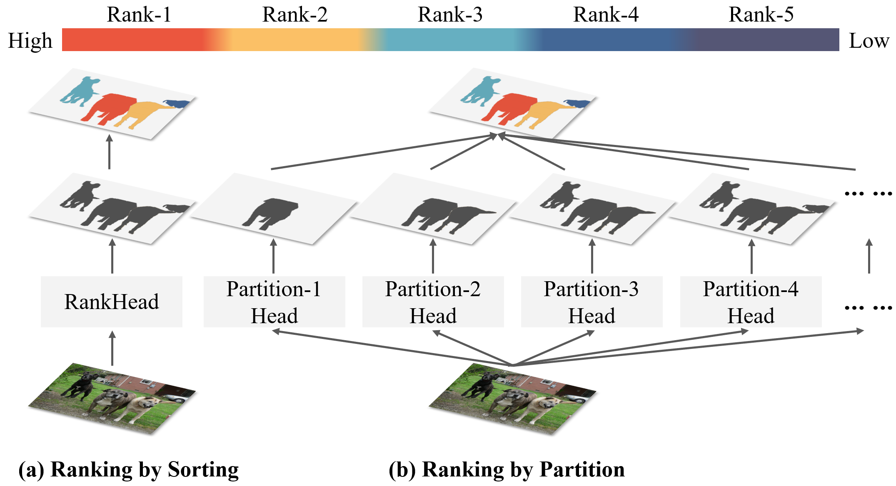
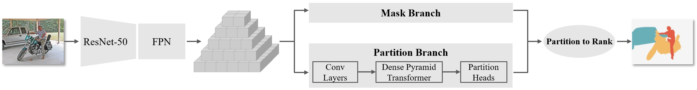

# Partitioned Saliency Ranking with Dense Pyramid Transformers. ACM MM, 2023. [Arxiv](https://arxiv.org/abs/2308.00236)


# Requirements
- Python $\ge$ 3.8
- PyTorch $\ge$ 1.9.0 and torchvision that matches the installation.
- setuptools == 59.5.0
- numpy == 1.23.0
# Environment
The code is tested on CUDA 11.1 and pytorch 1.9.0, change the versions below to your desired ones.
First install AdelaiDet and Detectron2 following the offical guide: [AdelaiDet](https://github.com/aim-uofa/AdelaiDet)

Then build PSR with:

    cd PSR
    python setup.py build develop

# Dataset
Download the datasets from the following links from original authors
- **ASSR**: [Github](https://github.com/SirisAvishek/Attention_Shift_Ranks)
- **IRSR**: [Github](https://github.com/dragonlee258079/Saliency-Ranking)
# Usage
## Pre-trained models
Model weights are come from AdelaiDet:
| Model | Config | Download|
|--|--|--|
| R50 | [config](configs/R50_3x.yaml) | [model](https://cloudstor.aarnet.edu.au/plus/s/chF3VKQT4RDoEqC/download) |
| R101 | [config](configs/R101_3x.yaml) | [model](https://cloudstor.aarnet.edu.au/plus/s/9w7b3sjaXvqYQEQ)
## Train
    python train_psr.py --config-file configs/R50_3x.yaml
## Inference

    python train_psr.py --config-file configs/R50_3x.yaml \
        --eval-only MODEL.WEIGHTS {PATH_TO_PRE_TRAINED_WEIGHTS}
Please replace `{PATH_TO_PRE_TRAINED_WEIGHTS}` to the pre-trained weights

## Citation
```BibTeX
@inproceedings{mm2023psr,
  title={Partitioned Saliency Ranking with Dense Pyramid Transformers},
  author={Sun, Chengxiao and Xu, Yan and Jialun, Pei and Fang, Haopeng and Tang, He},
  booktitle={Proceedings of the 31st ACM International Conference on Multimedia (MM '23), October 29-November 3, 2023, Ottawa, ON, Canada,
  year={2023}
}
```
